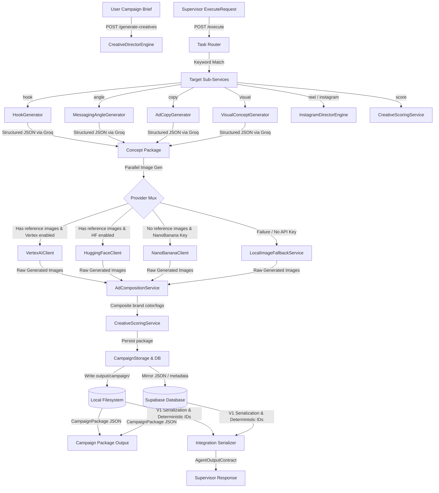

# Creative Director Engine - System Architecture

This document maps out the system architecture, file structure, API endpoints, supervisor integration layers, and core data flow pipelines of the Creative Director Engine.

---

## 📁 Project Structure

```text
creative-director/
├── app/
│   ├── api/
│   │   ├── routes/
│   │   │   ├── creatives.py       # Campaign generation and list endpoints
│   │   │   ├── instagram.py       # Reels analysis and scripting endpoints
│   │   │   └── execute.py         # Supervisor integration (/execute, /health)
│   │   ├── contracts.py           # V1 Supervisor Integration schemas
│   │   └── auth.py                # Tenant authentication and API key verification
│   ├── core/
│   │   ├── config.py              # Application configuration and credentials envs
│   │   └── supabase.py            # Supabase database client and connectivity helpers
│   ├── models/
│   │   └── creative.py            # Campaign, Copy, Hook, and Concept models
│   ├── providers/
│   │   ├── groq_llm.py            # Groq chat completion API client (with retry/backoff)
│   │   ├── nanobanana.py          # NanoBanana image and video generation client
│   │   ├── vertex_ai.py           # Vertex AI (Gemini/Imagen) client wrapper
│   │   └── huggingface.py         # HuggingFace client wrapper for image generators
│   └── services/
│       ├── engine.py              # Main CreativeDirectorEngine orchestrator
│       ├── generators.py          # LLM wrappers for Hooks, Angles, Copy, and Visual Concepts
│       ├── scoring.py             # LLM evaluator for Hook-Angle-Copy-Image alignments
│       ├── composition.py         # AdCompositionService for logo and brand styling layers
│       ├── preview.py             # Feed preview HTML & CSS card visualizer
│       ├── database.py            # Database client for persisting runs in Supabase
│       ├── storage.py             # Local storage manager for packages and manifests
│       ├── instagram_engine.py    # Director engine for Reels processing
│       ├── instagram_analyzer.py  # Analysis of transcripts and reels performance
│       ├── script_writer.py       # Shot-by-shot creator-ready video scripts
│       ├── reels_director.py      # Detailed cinematic director package builder
│       ├── viral_pattern_engine.py# Scans competitor reels for retention hooks
│       ├── trend_detector.py      # Identifies emerging video patterns and audio trends
│       ├── task_router.py         # Supervisor task routers mapping input words to services
│       └── integration_serializer.py # Converts internal payloads into V1 supervisor contracts
```

---

## ⚙️ Core Architecture Concepts

### 1. Service Container & DI
The application initializes dependencies inside a central `ServiceContainer` (defined in [engine.py](file:///c:/Users/abhis/Downloads/creativedir/creative-director/app/services/engine.py#L488)). 
- Instantiates clients like `GroqLLMProvider`, `NanoBananaClient`, `VertexAIClient`, `HuggingFaceClient`.
- Instantiates domain services: `HookGenerator`, `MessagingAngleGenerator`, `AdCopyGenerator`, `VisualConceptGenerator`.
- Injects generators and providers directly into `CreativeDirectorEngine` and `InstagramDirectorEngine`.
- Registered on the FastAPI instance `app.state.container` for endpoint access.

### 2. Campaign Processing Engine
The `CreativeDirectorEngine` coordinates multi-stage campaigns:
1. **Ideation**: Calls Hook and Messaging Angle generators in parallel via `asyncio.gather`.
2. **Copy & Scene Drafting**: Utilizes generated hooks and angles to construct platform-specific ad copy and visual layout descriptions.
3. **Asset Synthesis**: Routes to active image generation models (Vertex, HF, NanoBanana, Local Fallback) in parallel.
4. **Rendering**: Composites final ad layout with logo, overlays, and color palettes.
5. **Scoring & Output**: Performs structured evaluations, builds a campaign folder structure, and records outcomes in Supabase and the filesystem.

---

## 🔌 API Endpoints

### User & Client Facing Endpoints
- `POST /generate-creatives` : Triggers the full creative engine from a campaign brief.
- `GET /top-creatives` : Returns the highest scoring creatives filtered by platform.
- `GET /campaign-history` : Returns list of previous campaign packages.

### Supervisor Integration Endpoints (V1 Contract Compliance)
- `GET /health` : Returns system health probes and identifies service name as `"creative_director_agent"`. Used for service discovery.
- `POST /execute` : Centralized orchestration endpoint for autonomous workflows:
  - Takes `ExecuteRequest` (containing `trace_id`, `run_id`, `session_id`, `user_input`, `context`).
  - Routes tasks based on explicit supervisor parameters or keyword matching.
  - Converts results using `serialize_to_v1()` into a standard `AgentOutputContract`.
  - **Zero-Failure Rule**: Catches internal errors/timeouts and serializes them into an error envelope within the contract. Never returns HTTP 500.

---

## 🗺️ System Data Flow Diagram



---

## 🔍 Trace Propagation & Idempotency Rules

### Trace Propagation
To track operations across distributed boundaries, supervisor trace IDs flow downstream through the engine:
1. `trace_id`, `run_id`, and `session_id` are extracted from the incoming `/execute` request.
2. Every log line logs these details in the format:
   ```python
   logger.info("Log message trace_id=%s run_id=%s session_id=%s", trace_id, run_id, session_id)
   ```
3. This propagates context, ensuring trace-joining is possible in aggregators.

### Deterministic ID Generation
To ensure idempotency and stable IDs for insights and opportunities, IDs are derived deterministically:
- Formula: `sha1(type + "|" + description)[:12]`
- Same input string always returns the exact same 12-character hexadecimal key (e.g. `36cf30dc5ab7`).
