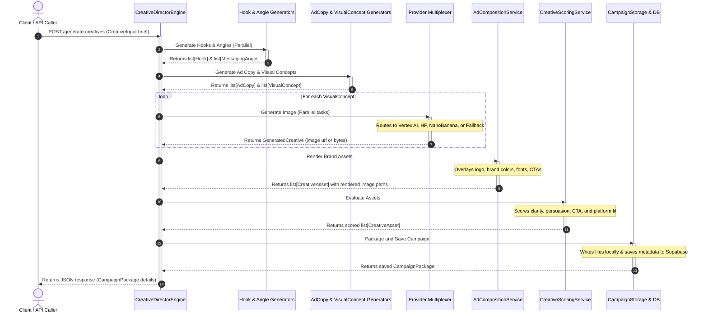
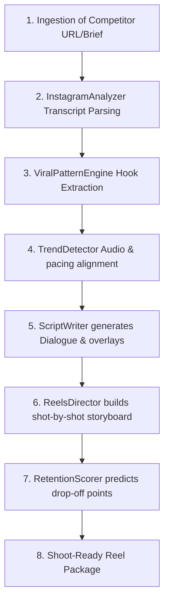
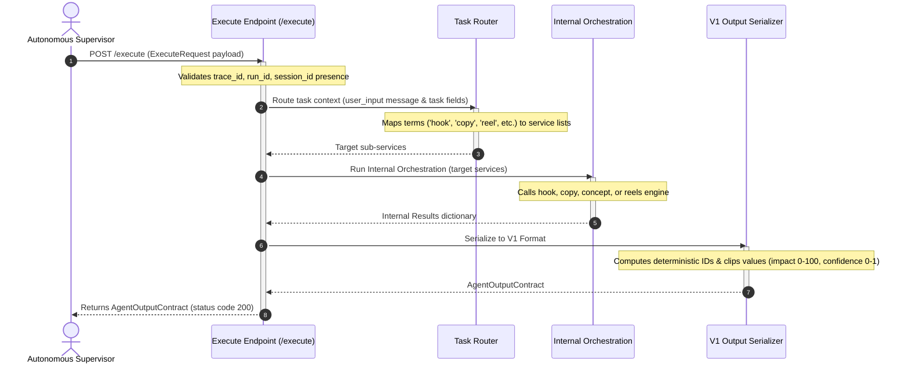

# Creative Director Engine - Workflow Pipelines

This document details the step-by-step workflows of the Creative Director Engine, covering campaign generation, Instagram Reel scripting, and Supervisor integration.

---

## 🚀 1. Campaign Generation Workflow

The main campaign generation flow is managed by `CreativeDirectorEngine.generate_campaign()` (defined in [engine.py:L300](file:///c:/Users/abhis/Downloads/creativedir/creative-director/app/services/engine.py#L300)).

### Step-by-Step Breakdown:
1. **Brief Ingestion**: An API client calls `POST /generate-creatives` with parameters like brand name, audience, benefits, colors, logos, and target platform.
2. **Concept Stage**:
   - `HookGenerator` and `MessagingAngleGenerator` run concurrently using Pydantic validation via the Groq LLM client.
   - Using the output hooks and angles, `AdCopyGenerator` compiles copy combinations.
   - `VisualConceptGenerator` translates copy and branding directives into visual concepts, observing the **Zero Meta-Composition Rule**.
3. **Image Synthesis**:
   - `generate_single_image` selects the best provider:
     - **Vertex AI (Gemini/Imagen)** or **Hugging Face (Flux)** is preferred if the brief contains uploaded reference images.
     - **NanoBanana API** handles text-overlay generation when no references are provided.
     - **LocalImageFallbackService** runs if API keys are missing or failures occur.
4. **Rendering & Compositing**:
   - `AdCompositionService` downloads generated images, resizes them to the platform ratio, adds overlays, sets text positioning, and renders the logo image.
   - `AdPreviewGenerator` renders feeds cards (like an Instagram ad template) for preview.
5. **Scoring & Sorting**:
   - `CreativeScoringService` evaluates copy alignment, clarity, and aesthetics, sorting final assets in descending order of total score.
6. **Persistence**:
   - Files (`manifest.json`, copy, hooks, images, layouts) are saved locally under `output/campaign-slug/timestamp/`.
   - Manifest metadata is mirrored to Supabase.
   - Returns a structured `CampaignPackage` response.

---

## 📹 2. Instagram Reels Analysis & Scripting Pipeline

This pipeline parses existing short-form videos and drafts shoot-ready script director packages.

### Step-by-Step Breakdown:
1. **Ingestion**: `InstagramIngestor` downloads metadata, transcript data, and metrics from video posts.
2. **Analysis**: `InstagramAnalyzer` reviews hooks, visual patterns, and transitions.
3. **Pattern Extraction**: `ViralPatternEngine` parses what hook types and structures successfully capture retention.
4. **Scriptwriting**: `ScriptWriter` drafts a creator-ready script incorporating speech, B-roll guides, screen captions, pacing markers, and loop triggers.
5. **Cinematic Direction**: `ReelsDirector` creates a storyboard detailing timeline sequences, camera movement angles (e.g., zooms, panning), B-roll visual details, caption colors, and audio triggers.
6. **Retention Scoring**: `RetentionScorer` rates the storyboard and script for viral probability and retention performance, suggesting changes before filming.

---

## 🔌 3. Supervisor Integration Execution Pipeline

This workflow governs how the engine responds when commanded by the autonomous supervisor via the `/execute` API endpoint.

### Step-by-Step Breakdown:
1. **Supervisor Call**: The supervisor issues a payload to `/execute`.
2. **Routing Decision**:
   - `task_router.py` checks for an explicit supervisor task list.
   - If empty, it runs keyword mapping on `user_input.message`:
     - *"hook"* -> Hook generator.
     - *"copy"* -> Ad copy generator.
     - *"visual"* -> Visual concept planner.
     - *"reel/video/instagram"* -> Instagram scripting engine.
3. **Engine Run**: Runs the designated generators. Logging templates include the current request's `trace_id`, `run_id`, and `session_id`.
4. **Contract Serialization**:
   - `integration_serializer.py` normalizes ratings: impact is clipped to `0-100`, confidence to `0-1`.
   - Generates deterministic IDs for insights/opportunities using `sha1(type + "|" + description)[:12]`.
   - **Error Handling Wrap**: If an exception or timeout occurs, the endpoint catches it and returns a valid `AgentOutputContract` with `status="failed"` and the error details inside the payload. It never fails with an HTTP 500 status.
